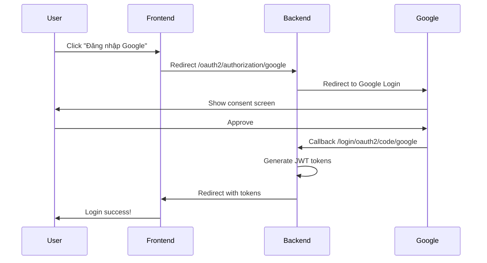

# 🚀 Hướng dẫn cấu hình Google OAuth cho Production

## 📋 Tổng quan
Để Google OAuth hoạt động trên domain production `https://evcare.vercel.app`, bạn cần thực hiện các bước sau:

---

## 1️⃣ Cấu hình Google Cloud Console

### Bước 1: Truy cập Google Cloud Console
1. Mở [Google Cloud Console](https://console.cloud.google.com/)
2. Chọn project của bạn hoặc tạo project mới
3. Vào menu **APIs & Services** → **Credentials**

### Bước 2: Cấu hình OAuth 2.0 Client
1. Tìm OAuth 2.0 Client ID đang sử dụng:
   - Client ID: `202746327765-9shovegi2uc1545d0gkdmpo16lvjut61.apps.googleusercontent.com`
   
2. Click vào Client ID để chỉnh sửa

3. **Thêm Authorized JavaScript origins:**
   ```
   https://evcare.vercel.app
   https://your-backend-domain.com (nếu backend ở domain khác)
   ```

4. **Thêm Authorized redirect URIs:**
   ```
   https://your-backend-domain.com/login/oauth2/code/google
   ```
   
   ⚠️ **Lưu ý**: Backend redirect URI phải trỏ đến domain backend thực tế

5. Click **Save** để lưu thay đổi

---

## 2️⃣ Cấu hình Backend (Spring Boot)

### Backend phải được deploy và có domain riêng
Ví dụ: 
- Railway: `https://evcare-production.up.railway.app`
- Render: `https://evcare-api.onrender.com`
- Heroku: `https://evcare-backend.herokuapp.com`

### Cấu hình biến môi trường:

```bash
# Production Environment Variables
FRONTEND_URL=https://evcare.vercel.app
SPRING_BACKEND_URL=https://your-backend-domain.com

# Google OAuth (giữ nguyên)
GOOGLE_CLIENT_ID=202746327765-9shovegi2uc1545d0gkdmpo16lvjut61.apps.googleusercontent.com
GOOGLE_CLIENT_SECRET=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
```

### File `application.yml` đã được cập nhật:
```yaml
frontend:
  url: ${FRONTEND_URL:http://localhost:5000}

spring:
  application:
    url: ${SPRING_BACKEND_URL:http://localhost:8080}
  security:
    oauth2:
      client:
        registration:
          google:
            redirect-uri: "{baseUrl}/login/oauth2/code/google"
```

---

## 3️⃣ Cấu hình Frontend (Vercel)

### Vercel Environment Variables:
```bash
VITE_BACKEND_URL=https://your-backend-domain.com
```

### File `.env.production` (nếu cần):
```env
VITE_BACKEND_URL=https://your-backend-domain.com
```

---

## 4️⃣ Luồng hoạt động Google OAuth



---

## 5️⃣ Deploy Steps

### A. Deploy Backend trước:
```bash
cd BE
# Build
mvn clean package -DskipTests

# Set environment variables trên platform deploy:
FRONTEND_URL=https://evcare.vercel.app
SPRING_BACKEND_URL=https://your-backend-domain.com
```

### B. Deploy Frontend sau:
```bash
cd FE
# Build
npm run build

# Vercel Environment Variables:
VITE_BACKEND_URL=https://your-backend-domain.com
```

---

## 6️⃣ Testing

### Local Testing:
```bash
# Backend
FRONTEND_URL=http://localhost:5000 mvn spring-boot:run

# Frontend
VITE_BACKEND_URL=http://localhost:8080 npm run dev
```

### Production Testing:
1. Truy cập `https://evcare.vercel.app`
2. Click "Đăng nhập bằng Google"
3. Đăng nhập tài khoản Google
4. Kiểm tra redirect về trang chủ thành công

---

## 🔧 Troubleshooting

### Lỗi: `redirect_uri_mismatch`
**Nguyên nhân**: Redirect URI trong Google Console không khớp với backend URL

**Giải pháp**:
1. Kiểm tra Google Console → Authorized redirect URIs
2. Đảm bảo có: `https://your-backend-domain.com/login/oauth2/code/google`

### Lỗi: CORS
**Nguyên nhân**: Backend chưa cho phép frontend domain

**Giải pháp**: Kiểm tra `CorsConfig.java`:
```java
@Override
public void addCorsMappings(CorsRegistry registry) {
    registry.addMapping("/**")
            .allowedOrigins(
                "http://localhost:5000",
                "https://evcare.vercel.app"  // Thêm domain production
            )
            .allowedMethods("*")
            .allowCredentials(true);
}
```

### Lỗi: Token không được lưu
**Nguyên nhân**: Frontend không parse được URL callback

**Giải pháp**: Kiểm tra `AuthContext.tsx` xử lý callback từ URL

---

## 📝 Checklist

- [ ] Đã thêm domain vào Google Cloud Console (Authorized origins & redirect URIs)
- [ ] Backend đã được deploy và có domain
- [ ] Đã set biến môi trường `FRONTEND_URL` cho backend
- [ ] Frontend đã được deploy lên Vercel
- [ ] Đã set biến môi trường `VITE_BACKEND_URL` cho frontend
- [ ] Đã cập nhật CORS config cho phép domain production
- [ ] Test Google Login thành công trên production

---

## 🎯 URLs cần nhớ

| Môi trường | Frontend | Backend |
|-----------|----------|---------|
| **Development** | `http://localhost:5000` | `http://localhost:8080` |
| **Production** | `https://evcare.vercel.app` | `https://your-backend-domain.com` |

---

## ✅ Hoàn tất!

Sau khi hoàn thành các bước trên, Google OAuth sẽ hoạt động trên production! 🎉

**Lưu ý quan trọng**: 
- Backend PHẢI có domain riêng (không thể dùng localhost cho production)
- Redirect URI trong Google Console PHẢI khớp 100% với backend domain
- Frontend URL được cấu hình trong backend để redirect sau khi login


